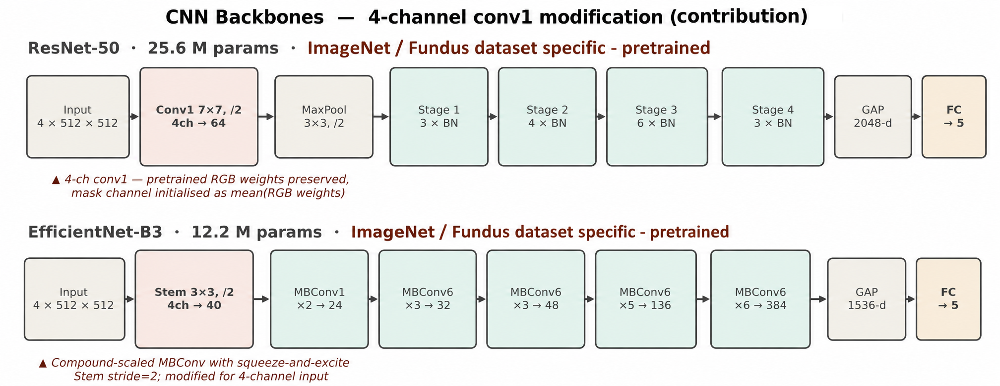

## 1. Тақырып

CNN моделінің архитектурасы

---

## 2. Слайд мазмұны

---

## 3. Баяндаушы сөзі

Диаграммада зерттеуде қолданылған архитектуралар көрсетілген. Эксперимент 1 факториалында екі тармақ салыстырылады:

- **Baseline тармағы** — ResNet-50 және EfficientNet-B3, **ImageNet**-те алдын ала оқытылған (табиғи кескіндер, кросс-домендік инициализация); кірісі 3×512×512 тензор.
- **Pipeline тармағы** — дәл сол CNN backbone-дары (ResNet-50 және EfficientNet-B3), бірақ **офтальмологияға бейімделген өзіндік-бақылаусыз алдын ала оқыту** (ophthalmology-specific self-supervised pretraining) негізінде инициализацияланған: CNN-үйлесімді домендік-бейімделген SSL протоколы (DINO / BYOL / SimCLR / MoCo тобынан) таңбаланбаған ретиналды фундус корпусында алдын ала оқытылып, содан кейін DR жіктеуіне fine-tune жасалады. Кірісі 4×512×512 тензор (RGB + FOV mask).

Шығыс векторы ResNet-50 үшін 2048-dimension, EfficientNet-B3 үшін 1536-dimension; екеуі де 5 класқа (DR 0–4) жіктеледі.

> Ескерту: SSL инициализациясы CNN-үшін табиғи болғандықтан, екі backbone да baseline және pipeline тармақтарында бірдей қолданылады (2×2 факториал қалпына келтірілді: A/B/C/D конфигурациялары). RETFound (ViT-Large) пайдаланылмайды — ол архитектураны өзгертіп, препроцессинг үлесін шатастырар еді.
