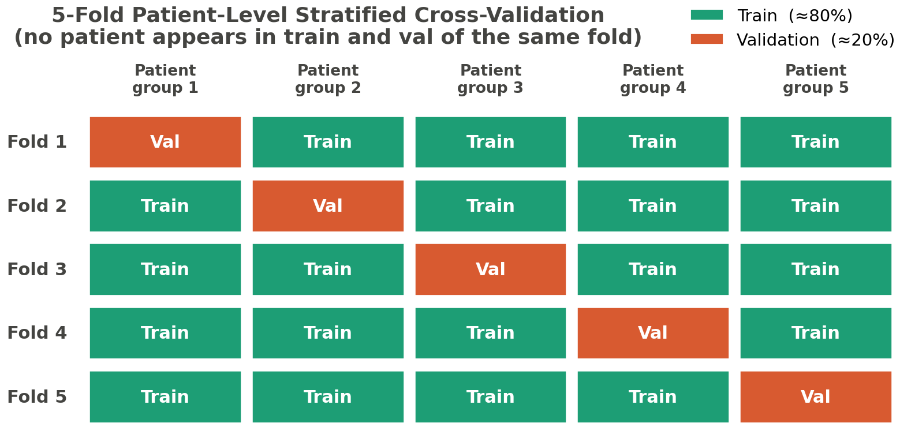

## 1. Тақырып

Оқыту параметрлері: Focal Loss, optimizer, 5-fold CV

---

## 2. Слайд мазмұны

---

## 3. Баяндаушы сөзі

Слайдта модельді оқытудың негізгі параметрлері көрсетілген. Модельдің сапасы мен тұрақтылығын бағалау үшін 5-фолдты patient-level  cross-validation әдісі қолданылды. Осының арқасында data leakage-дің алдын алып, көрсеткіштердің кездейсоқ жоғарылауын болдырмай, модельдің жалпылау қабілетін шынайы бағалауға мүмкіндік береді.

Сол жақтағы сызбада деректерді бөлу принципі көрсетілген: 4 топ шамамен 80 пайыз дерек train жиынына, ал 20 пайызы validation жиынына пайдаланылды. 

Оң жақта шығын функциясы ретінде пайдаланылған Focal Loss принципі көрсетілген. Қолданылған датасеттерде кластар арасында айқын дисбаланс болғандықтан, Focal Loss жеңіл мысалдардың үлесін азайтып, классификациялау қиын мысал деректері аз класстарға көбірек назар аударуға мүмкіндік береді.