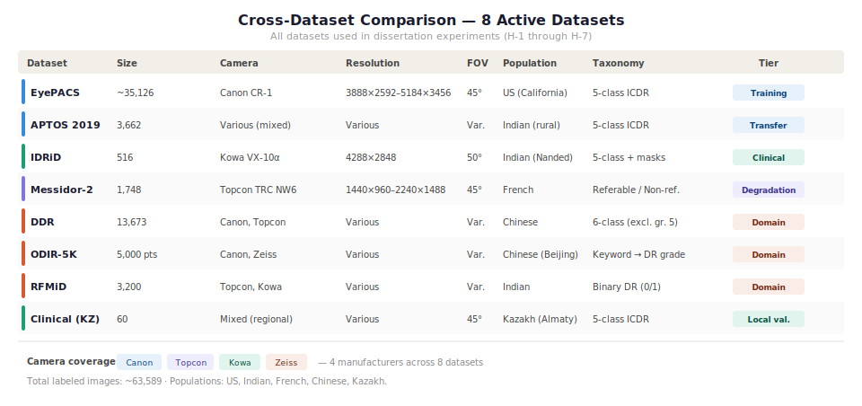

## 1. Тақырып

Деректер жиындары

---

## 2. Слайд мазмұны

---

## 3. Баяндаушы сөзі

Сол жақтағы диаграммада 8 деректер жиынындағы DR класстарының таралымы көрсетілген: EyePACS-те ең күшті дисбаланс (74% DR0 — Focal Loss-ты қолдану себебі), IDRiD ең теңгерімді 5-класты ICDR жиыны, Clinical KZ толық теңгерімді 5 класс — Grad-CAM бағалау үшін арнайы жобаланған.

Оң жақтағы кестеде барлық 8 датасет бір тізімде келтірілген. Жалпы алпыс үш мыңнан астам сурет - 5 популяцияны АҚШ, Индия, Франция, Қытай халық республикасы, Қазақстан және 4 камера өндірушісін қамтиды: Canon, Topcon, Kowa, Zeiss. 

Сонымен қатар суретте әр датасеттің қолданылу негізі көрсетілген: 
- EyePACS — оқыту негізі, 
- APTOS — transfer (3-гипотеза), 
- IDRiD — клиникалық бағалау (5-гипотеза), 
- Messidor-2 — деградация (5-гипотеза), 
- DDR / ODIR-5K / RFMiD — камера домен ауысуы (6-гипотеза), 
- Clinical KZ — жергілікті валидация

Осылайша 1-ден 6-ға дейінгі гипотезалар толық жабылады.

