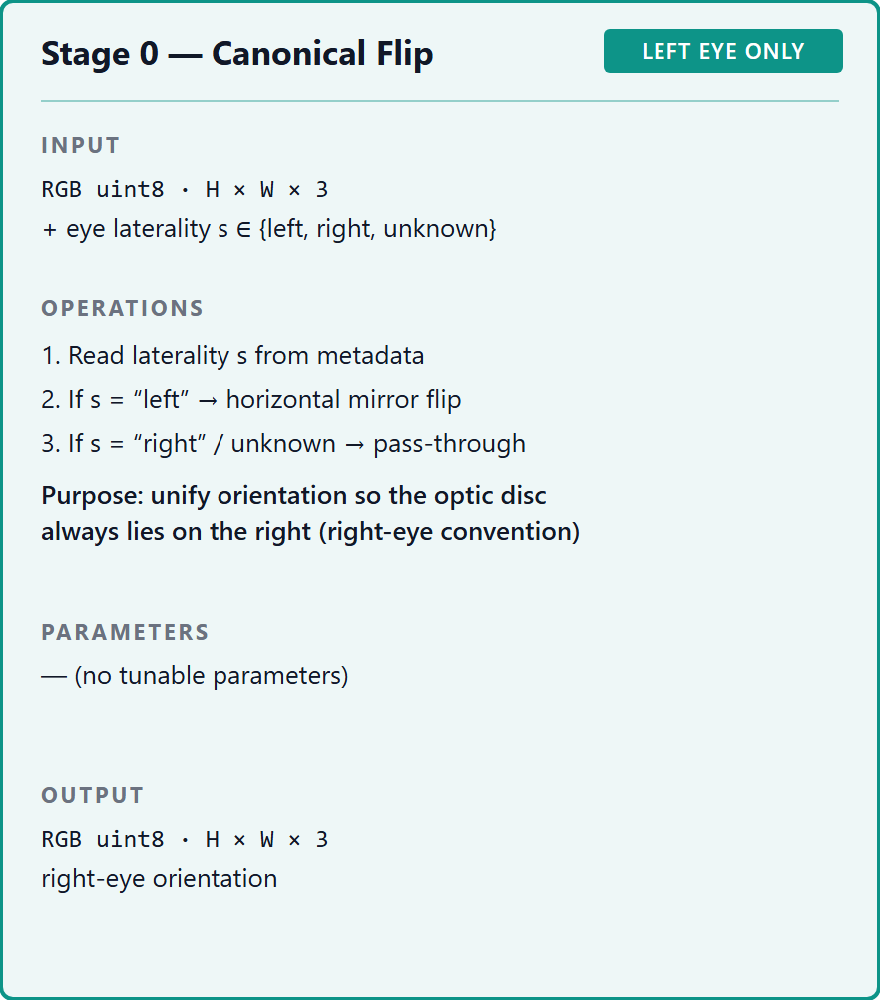
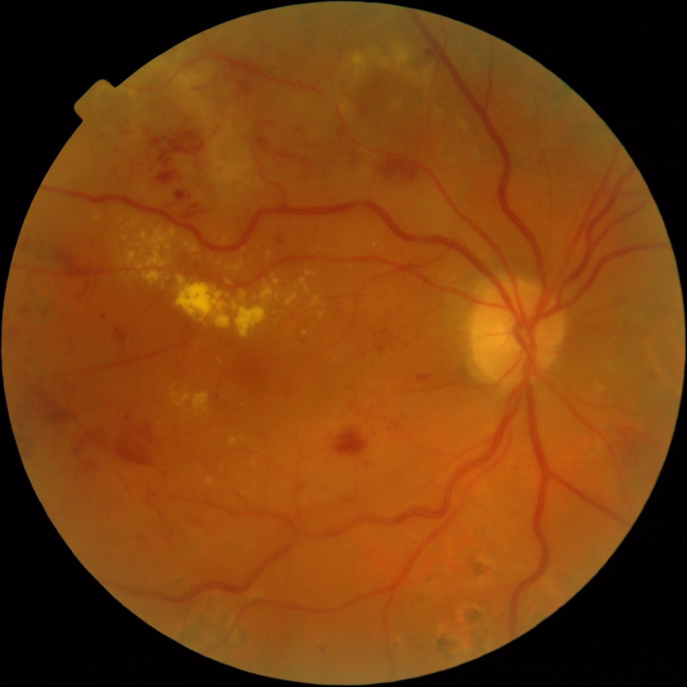
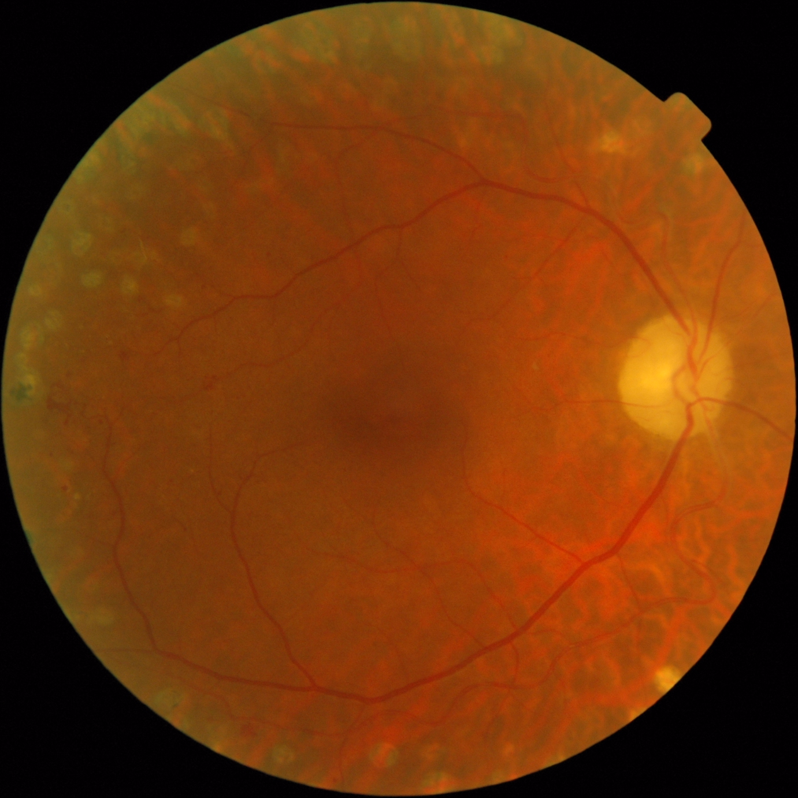

## 1. Тақырып

Каноникалық айналым (canonical flip)

---

## 2. Слайд мазмұны

---

## 3. Баяндаушы сөзі

Бұл кезеңде сол көздің суреттері горизонтальды айналдырылып, оң көздің суреттері сол қалпында қалдырылады. 

Нәтижесінде барлық кескіндер бір ортақ бағдарда — оптикалық диск әрқашан оң жақта орналасатын қалыпта — беріледі, бұл модельге оң мен сол көзді бөлек үйренудің қажеттілігін жояды.
