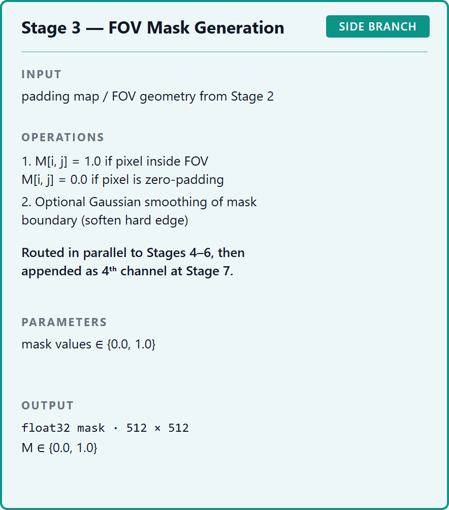

## 1. Тақырып

Көру өрісі маскасы (FOV mask)

---

## 2. Слайд мазмұны

---

## 3. Баяндаушы сөзі

Бұл кезеңде көру өрісінің шеңбер ішіндегі бөлігі ажыратылып, сыртқы қара аумақ — өңдеуге жатпайтын аймақ ретінде белгіленеді. Маска қосымша қабат ретінде кескінге жалғанады және модельге қай пиксельдерге назар аударып, қайсыларын ескермеу керектігін көрсетеді.
