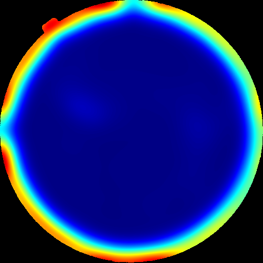
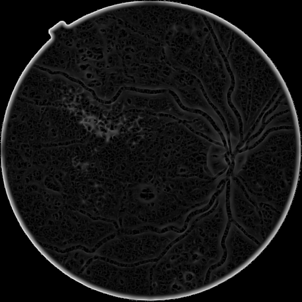

## 1. Тақырып

CLAHE — қан тамыр негіздемесі (vessel)

---

## 2. Слайд мазмұны

---

## 3. Баяндаушы сөзі

CLAHE — кескіннің контрастын жергілікті деңгейде күшейтетін әдіс. Слайдта оның тор қабықтың қан тамыр желісіне әсері көрсетілген: өңдеуден кейін майда тамырлар мен ұсақ микроаневризмалар анық ажыратылады, ал бұл белгілер диабеттік ретинопатияны ерте сатыларда анықтаудың негізгі көрсеткіштері болып табылады.
