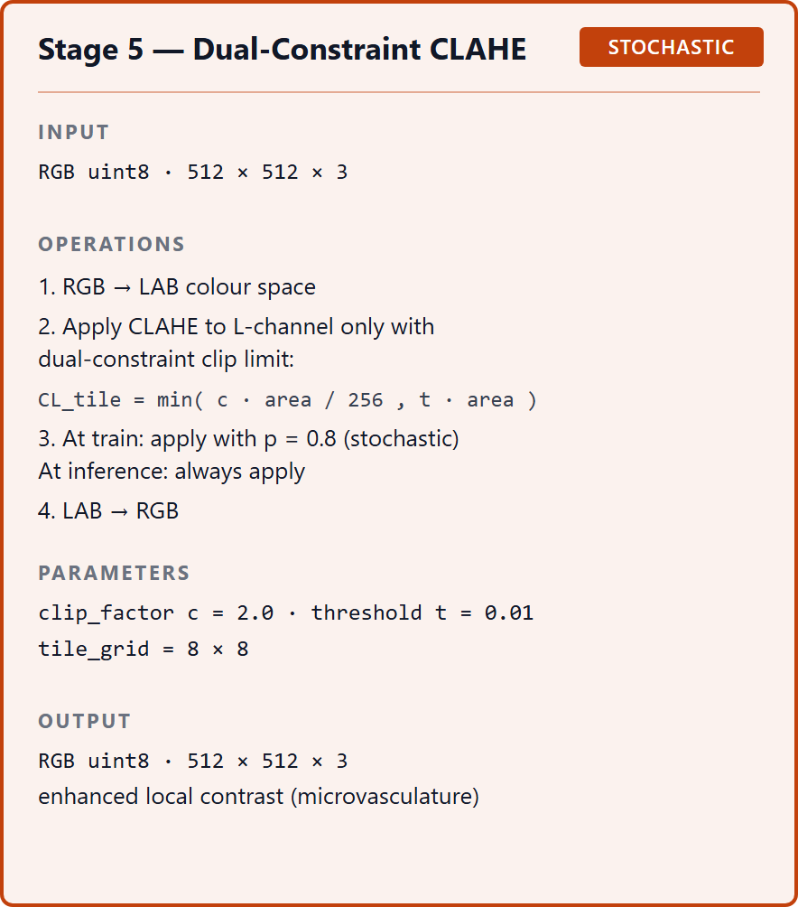
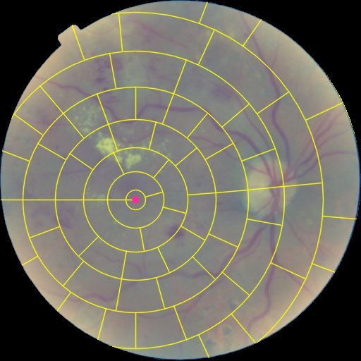
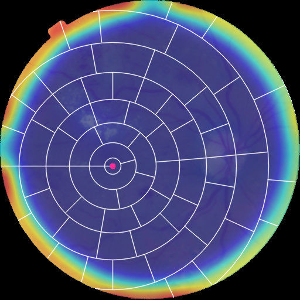

## 1. Тақырып

CLAHE — полярлық координаттар (polar)

---

## 2. Слайд мазмұны

---

## 3. Баяндаушы сөзі

Стандартты CLAHE кескінді тіктөртбұрышты блоктарға бөліп өңдейді, ал тор қабық —  шеңберлі объект. Бұл нұсқада блоктар фундустың дөңгелек құрылымына сай орналасып, контраст шеңбер бойынша біркелкі күшейтіледі — шетке таяу аймақтарда да тамырлар анық көрінетін болады.
