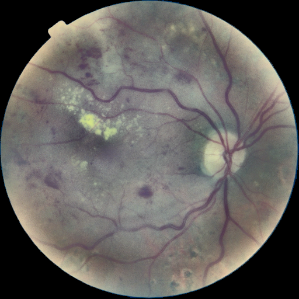
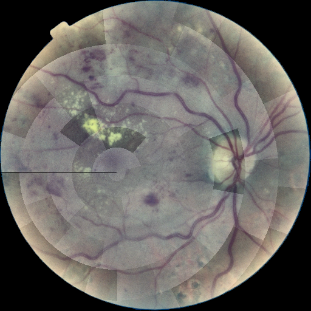

## 1. Тақырып

CLAHE — SV2 нұсқасы

---

## 2. Слайд мазмұны

---

## 3. Баяндаушы сөзі

Бұл — CLAHE-дің жетілдірілген нұсқасы: контрасттың шектен тыс күшейіп кетуін тежейтін екі шектеу қосылған. Зақым белгілері мен қан тамырлар жақсы көрінеді, бірақ кескінге артық шу қосылмайды — клиникалық диагноз симптомдарын сақтау үшін маңызды тепе-теңдік сақталады.
