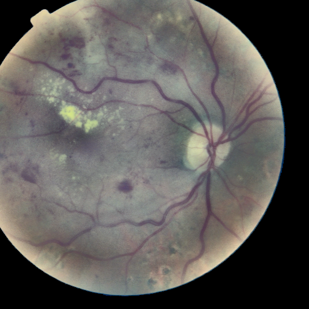
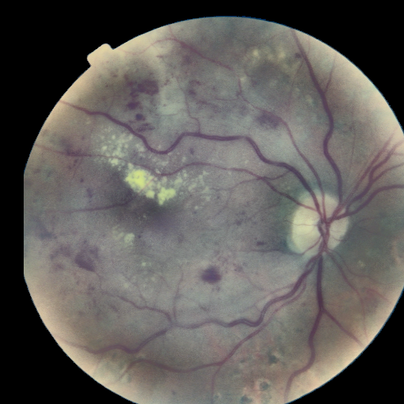
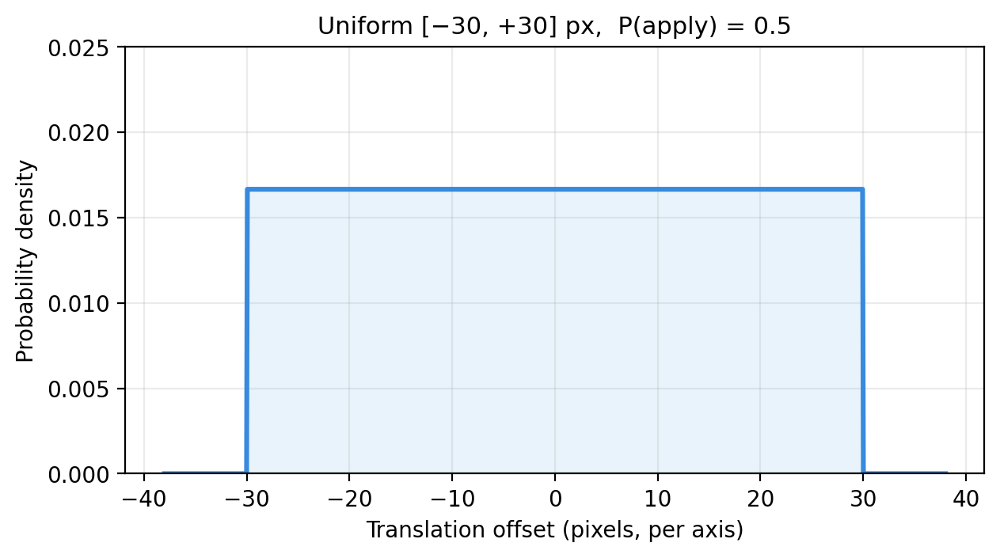

## 1. Тақырып

Аугментация: жылжыту (translation)

---

## 2. Слайд мазмұны

---

## 3. Баяндаушы сөзі

Оқыту фазасында кескін кездейсоқ бағытта аздап жылжытылады. Осы аугментация арқылы орталық бөлік нақты ортада тұрмаса да немесе 3-кезеңдегі кесу қате орындалса да модель диагнозды дұрыс қоюға үйренеді.
