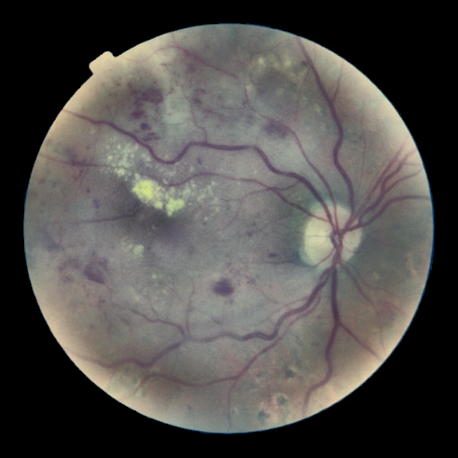
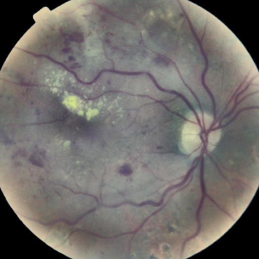
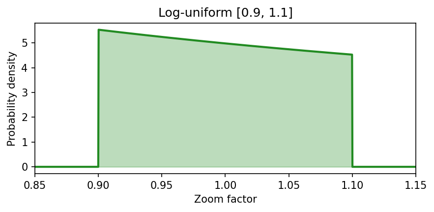

## 1. Тақырып

Аугментация: масштабтау (scale)

---

## 2. Слайд мазмұны

---

## 3. Баяндаушы сөзі

Бұл аугментацияда кескін кездейсоқ түрде шамалы үлкейтіліп немесе кішірейтіліп беріледі. Әр түрлі камера қашықтығымен немесе зум деңгейін яғни адами факторды азайтуға көмектеседі.
