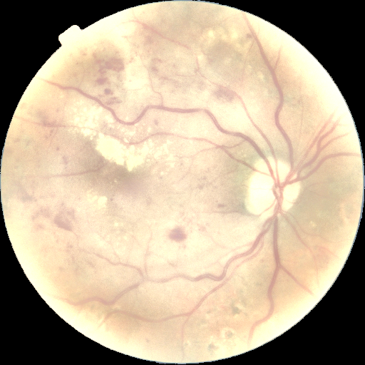
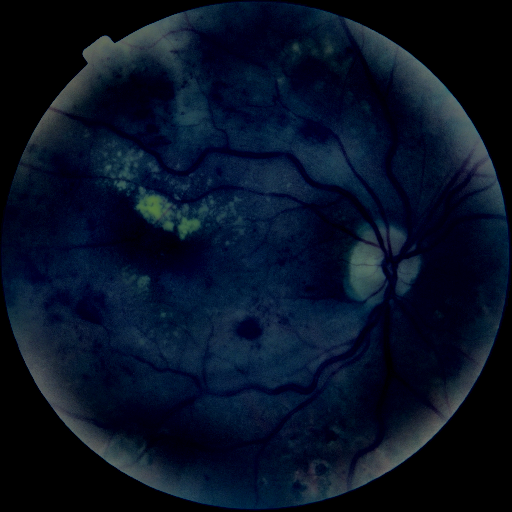
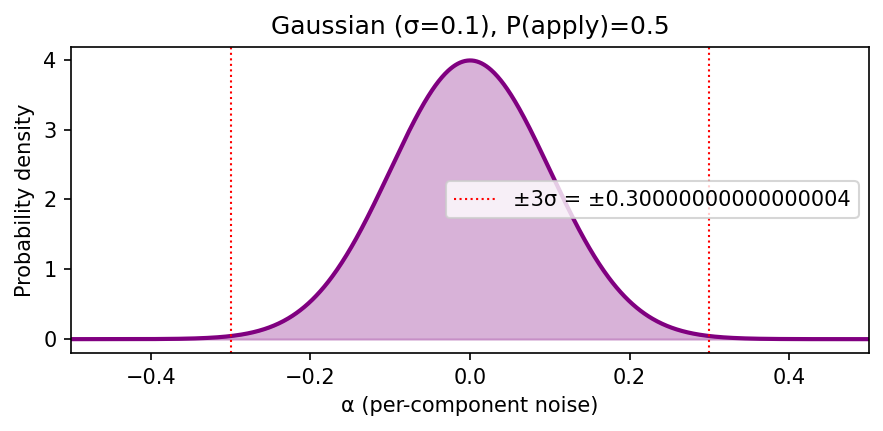

## 1. Тақырып

Аугментация: PCA түс jitter

---

## 2. Слайд мазмұны

---

## 3. Баяндаушы сөзі

Бұл аугментацияда кескіннің түс каналдары кездейсоқ аздап өзгертіліп беріледі. Әр камера түсті сәл өзгеше жеткізетіндіктен, осы вариация арқылы модель түске емес, тор қабықтың құрылымдық белгілеріне сүйеніп шешім қабылдауға үйренеді. 

Жарық суретке түсірудегі ең ойналмалы фактор болғандықтан аугментация кезінде де ең агрессивті кезең.
