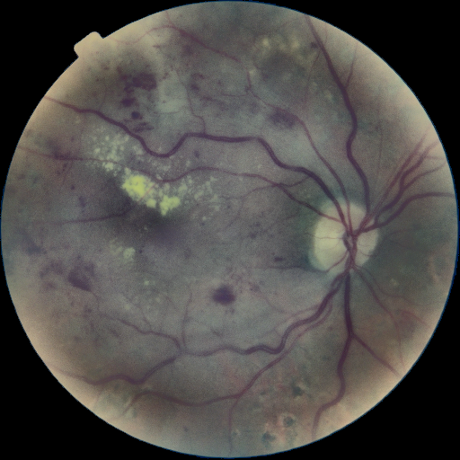
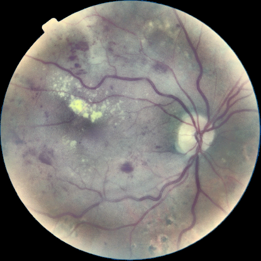
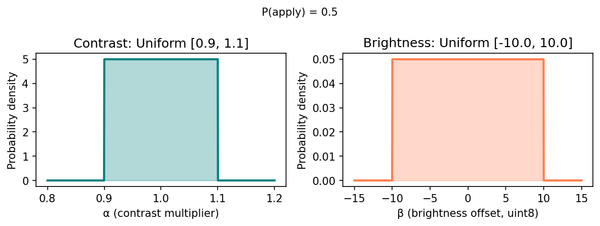

## 1. Тақырып

Аугментация: Гаусс шуы + JPEG компрессия (алу-вариативтілігі)

---

## 2. Слайд мазмұны

> ⚠️ Сурет активтері бұрынғы жарықтық/контраст аугментациясын көрсетеді — шу + JPEG үшін қайта генерациялау қажет.

---

## 3. Баяндаушы сөзі

Бұл кезеңде нақты клиникалық кескіндердегі ең жиі кездесетін екі бұзылу имитацияланады. Біріншісі — сенсор мен түсіру шуын білдіретін аддитивті Гаусс шуы (σ ∈ [2, 6], 15% ықтималдық). Екіншісі — кескіндер сақталатын форматтардың блок және хроматикалық артефактілерін білдіретін JPEG қайта-компрессиясы (сапа ∈ [70, 100], 20% ықтималдық).

Ықтималдықтар әдейі төмен: мақсат — модельге анда-санда нашарлаған мысалдарды көрсетіп, оны түсіру сапасына нәзіктіктен сақтандыру, бірақ оны бүлінген деректерде басым оқытпау.
