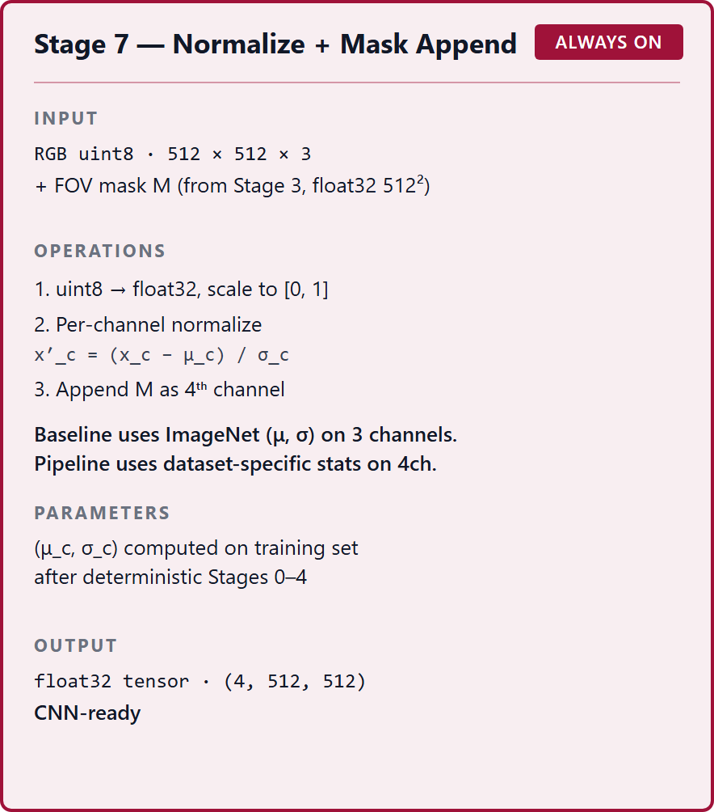
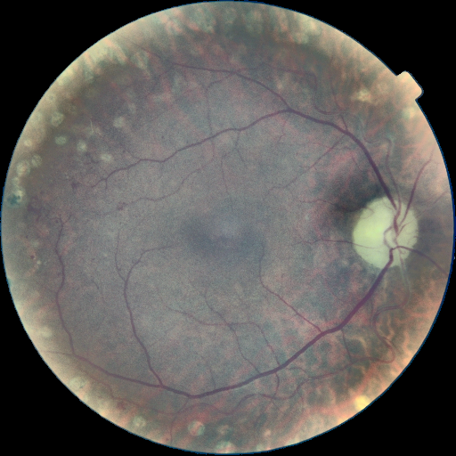
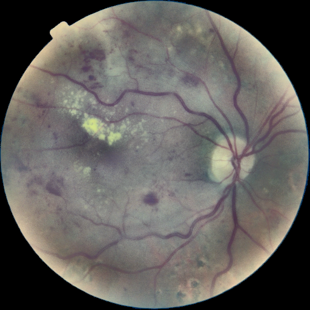

## 1. Тақырып

Деректер жиынына сәйкес нормализация (dataset-specific normalization)

---

## 2. Слайд мазмұны

---

## 3. Баяндаушы сөзі

Бұл — pipeline-ның соңғы кезеңі: кескіннің пиксельдік мәндері әрбір датасеттің өзіне тән орташа және ауытқу шамаларына сәйкес түзеледі, сосын модельге берілетін сандық кірісі дайындалады. Осыдан кейін кескін CNN-ге беріледі, ал препроцессингтің бүкіл жұмысы аяқталған болады.
