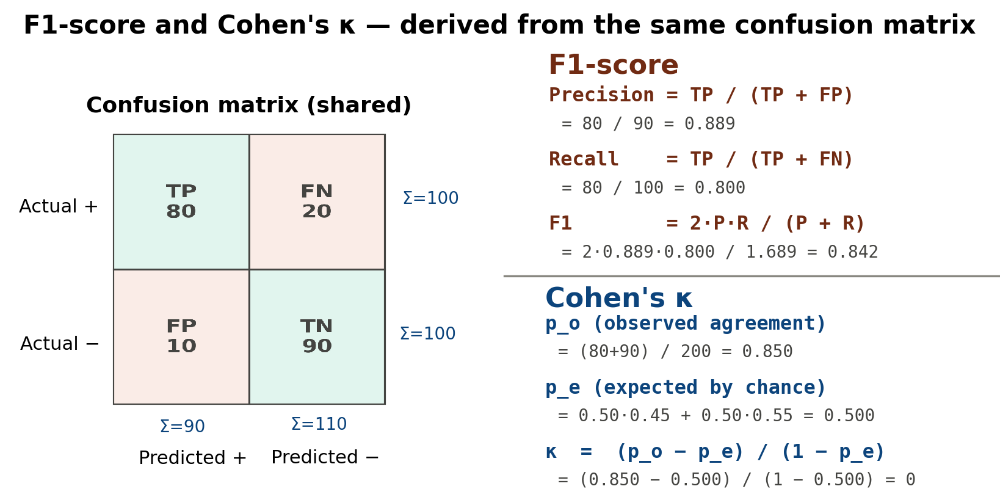
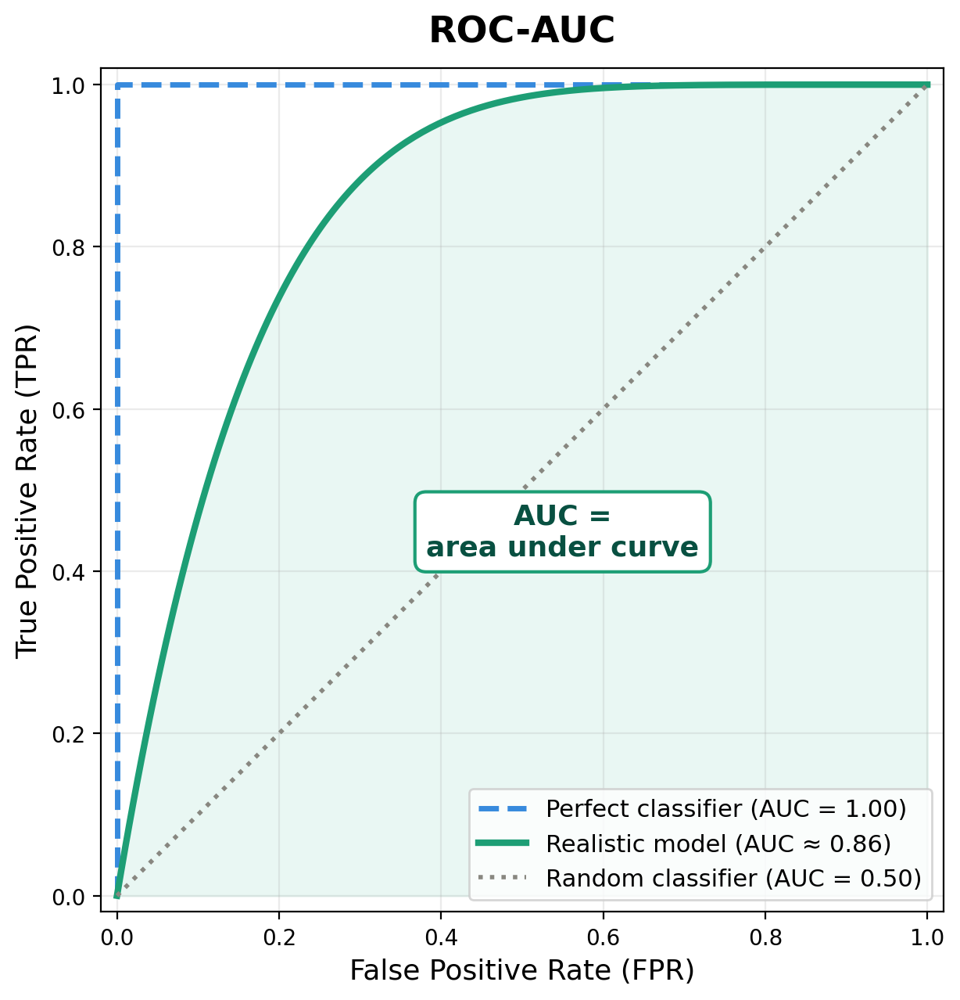
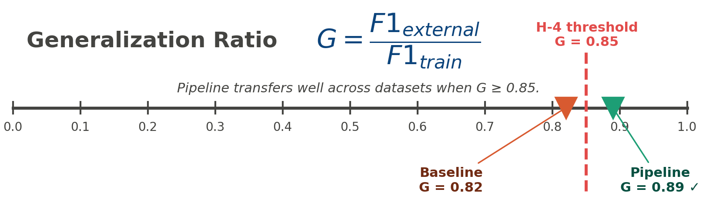
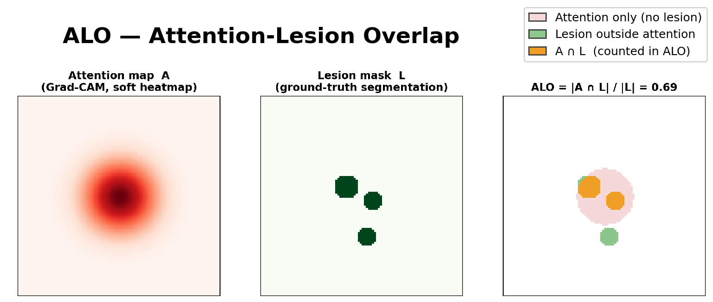

## 1. Тақырып

Метрикалар: F1, AUC, Cohen's κ, Generalization gap (G), ALO

---

## 2. Слайд мазмұны

---

## 3. Баяндаушы сөзі

Слайдта зерттеуде қолданылған бес негізгі сапа өлшеуіші көрсетілген. F1 мен Cohen модельдің класс бойынша дұрыс жіктеу қабілетін бағалайды, ал AUC сатылар арасындағы шекараны қаншалықты сенімді анықтайтынын көрсетеді.

Generalization gap — модель оқытылмаған сыртқы датасетте қаншалықты тұрақты жұмыс істейтінінің көрсеткіші. 

Ал ALO — Grad-CAM назарының шынайы зақым аймағымен сәйкестігін сандық өлшейтін метрика, клиникалық түсіндірмеліліктің негізгі көрсеткіші болып табылады.
