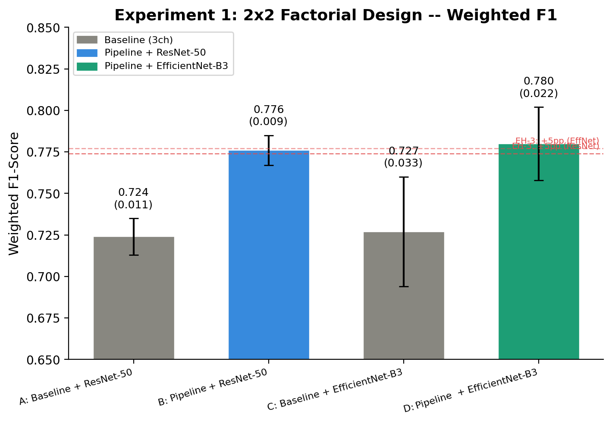
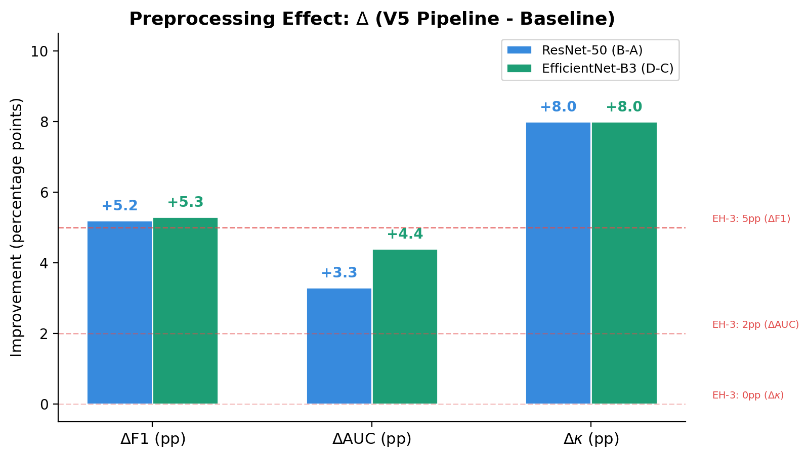
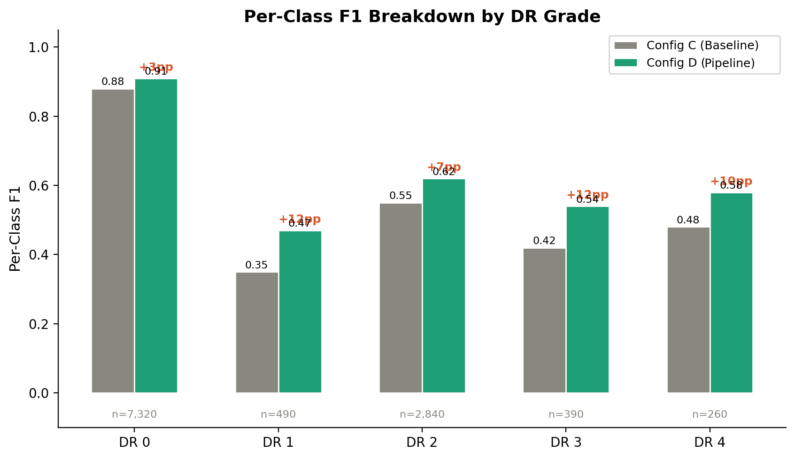

## 1. Тақырып

1-эксперимент: H-1 — Препроцессингтің доминанттылығы

---

## 2. Слайд мазмұны

---

## 3. Баяндаушы сөзі

Сол жақтағы суретте төрт факторлық дизайнның F1 нәтижелері көрсетілген: pipeline препроцессингімен оқытылған конфигурациялар baseline конфигурацияларынан айқын асып түседі, бұл препроцессингтің доминанттылығын дәлелдейді.

Ортадағы суретте препроцессинг қосылған кездегі F1, AUC және κ көрсеткіштерінің өсімі — барлығы H-1 гипотезасының алдын ала тіркелген шектерінен жоғары. 

Оң жақтағы суретте ретинопатия класы бойынша F1 талдауы көрсетілген: Pipeline моделі әсіресе аз кездесетін орта және ауыр сатыларда айқын жақсартуды бейнелейді.
