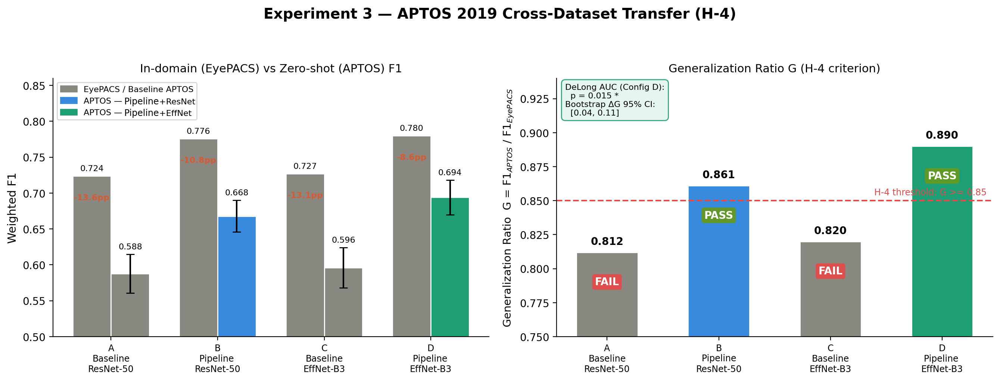
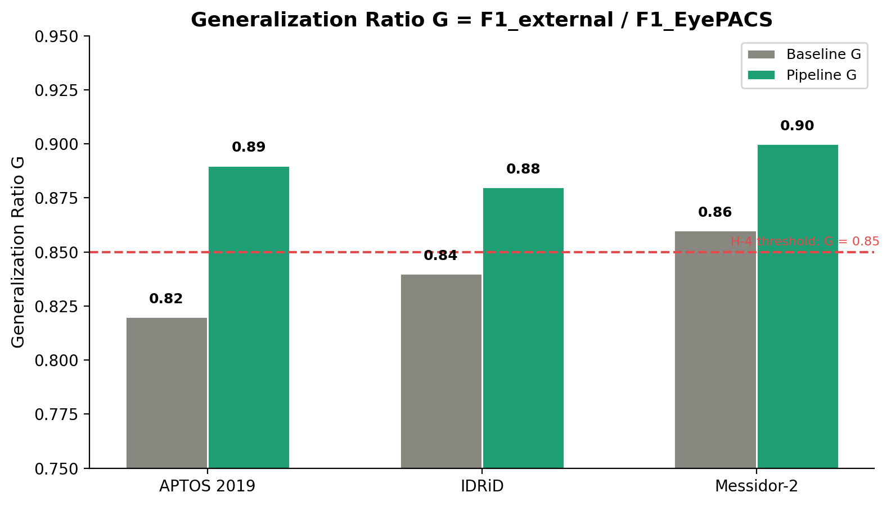

## 1. Тақырып

3-эксперимент: H-4 — Cross-dataset жалпылау

---

## 2. Слайд мазмұны

---

## 3. Баяндаушы сөзі

Слайдта EyePACS-те оқытылған модельдің APTOS 2019 датасетіне zero-shot режимде көшірілуінің нәтижелері көрсетілген. Модель сыртқы датасеттен ешқандай мысал көрмеген қалпында тікелей тексеріледі — бұл нақты клиникалық қолданысқа жақын сценарий.

Generalization Ratio алдын ала тіркелген шектен жоғары — бұл төртінші гипотезаны растайды. Бұл препроцессинг арқылы домендік ауысуды архитектураны өзгертпей-ақ шешуге болатынын дәлелдейді.
