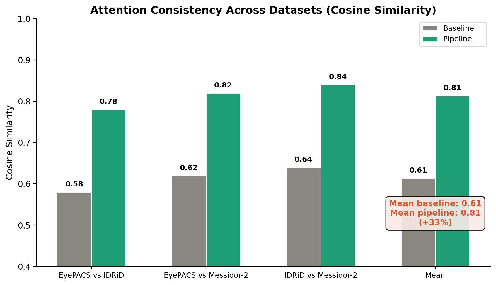

## 1. Тақырып

4-эксперимент: H-5 — Түсіндірмелілік (ALO/IoU + Grad-CAM)

---

## 2. Слайд мазмұны

---

## 3. Баяндаушы сөзі

Сол жақтағы суретте зақым типтері бойынша ALO мәндері келтірілген — Pipeline моделінде барлық төрт зақым типінде (микроаневризмалар, қанталаулар, қатты және жұмсақ экссудаттар) ALO айтарлықтай артқан. Бұл модель назарының дәл диагностикалық белгілерге шоғырлануын білдіреді. 

Астыдағы сурет әртүрлі датасеттер арасында назар тұрақтылығының жоғары екенін көрсетеді.

Оң жақтағы суретте baseline мен pipeline моделдерінің Grad-CAM heatmap-тары тікелей салыстырылған — Pipeline моделінде назар нақты зақым аймағында, ал baseline-да шашыраңқы. 
