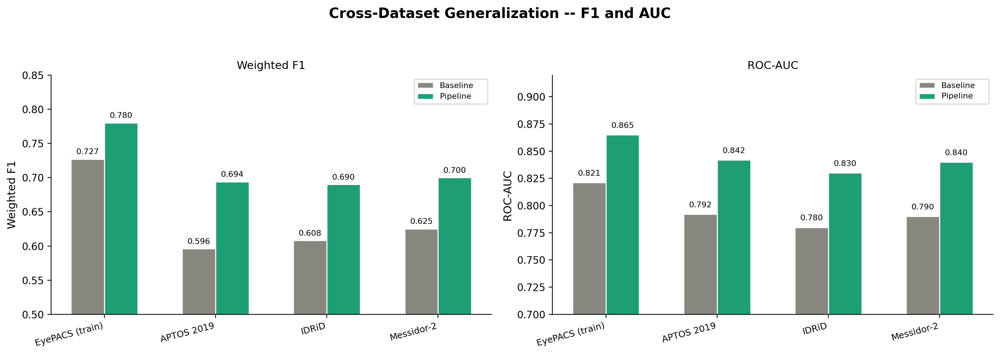

## 1. Тақырып

5-эксперимент: H-7 — Сапа төмендеуіне төзімділік

---

## 2. Слайд мазмұны

---

## 3. Баяндаушы сөзі

Слайдта модельдің сапасы IDRiD және Messidor-2 датасеттеріне көшу нәтижелері көрсетілген. Кескін сапасы төмендеген сайын F1 баяу түседі, бірақ Pipeline моделінде деградация baseline-мен салыстырғанда айтарлықтай аз — бұл алтыншы гипотезана растайды.

Бұл нәтиже модельдің клиникалық практикадағы сапасы әртүрлі суреттерге төзімді болатынын білдіреді.