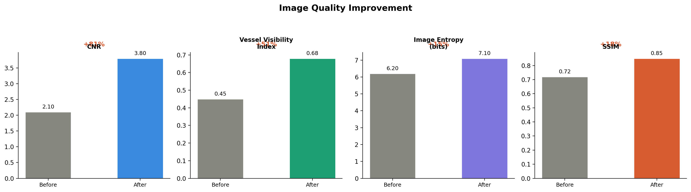

## 1. Тақырып

Зерттеу синтезі: препроцессинг — модель компоненті

---

## 2. Слайд мазмұны

---

## 3. Баяндаушы сөзі

Сол жақтағы radar диаграммасы baseline мен pipeline моделдерін алты өлшем бойынша салыстырады — Pipeline моделі барлық бағыттарда алдыңғы орында тұрады.

Астындағы сурет статистикалық тестердің қорытындысы: DeLong мен MacNemar тесттері жақсарудың кездейсоқ еместігін, ал bootstrap сенімділік аралықтары — өзгерістердің сенімді диапазонда екенін көрсетеді.

Оң жақтағы суретте кескін сапасы метрикалары (CNR, VVI, Entropy, SSIM) бойынша препроцессингтің кескінді объективті тұрғыдан жақсартатыны бекітілген. 

-----------------------------
CNR (Contrast-to-Noise Ratio) — сигнал контрастының шуға қатынасын бағалау көрсеткіші. 
VVI (Vessel Visibility Index) — қан тамырларының көріну деңгейін сипаттайтын индекс. 
Entropy — суреттегі ақпарат пен текстура күрделілігінің өлшемі. 
SSIM (Structural Similarity Index Measure) — екі суреттің құрылымдық ұқсастығын бағалау метрикасы.
