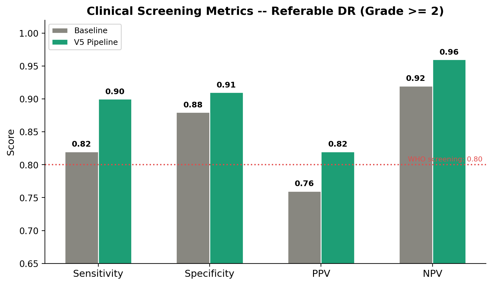
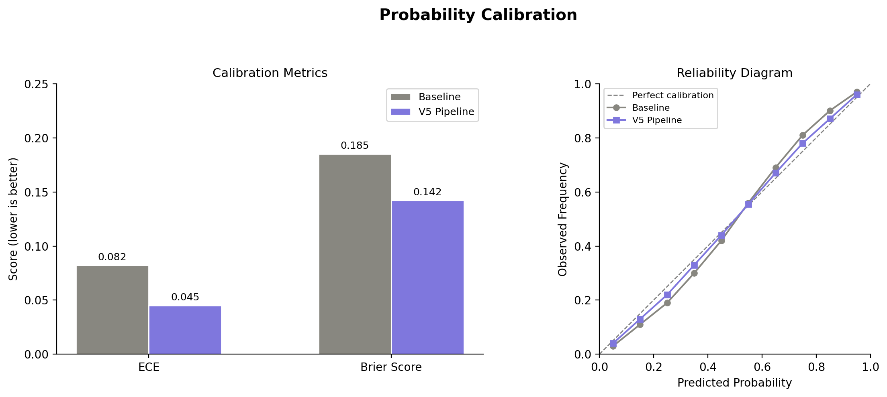
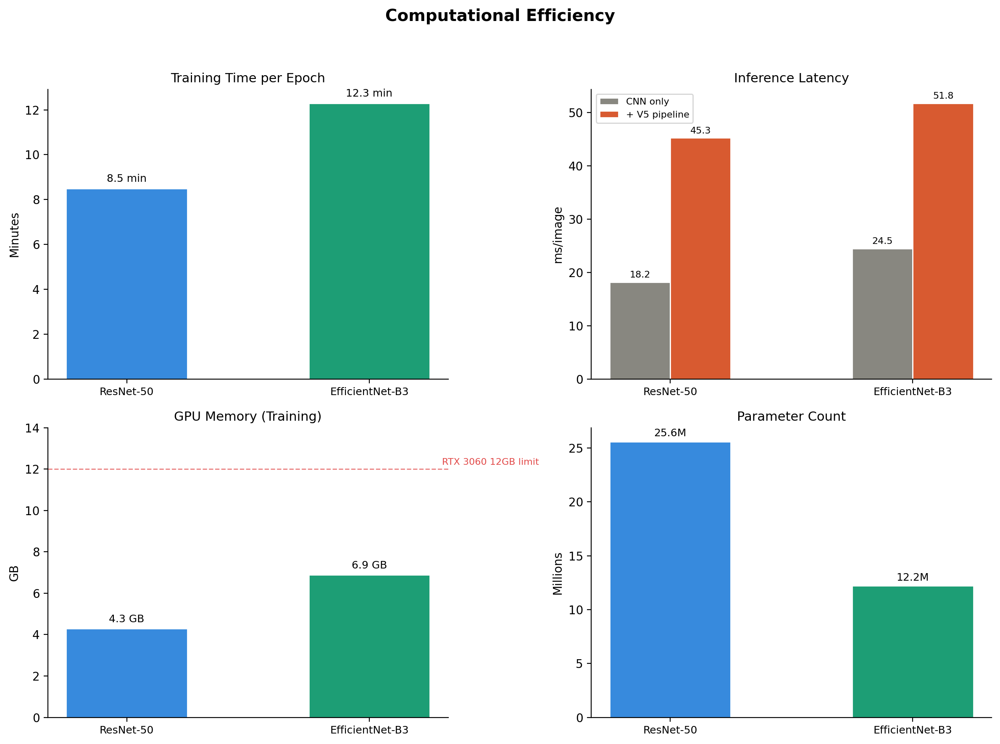

## 1. Тақырып

Клиникалық дайындық және SOTA позициясы

---

## 2. Слайд мазмұны

---

## 3. Баяндаушы сөзі

Сол жақтағы суретте referable бойынша клиникалық метрикалар көрсетілген — ұсынылған 80 пайыздық шегінен жоғары, бұл модельдің скрининг сценарийінде тұрақтылығын көрсетеді.

Асындағы суретте калибрация мүмкіндігіның сапасы келтірілген — модель шығаратын ықтималдық бағалары шынайы жиілікке жақын, бұл клиникалық шешімге сенімді негіз береді. 

Оң жақта есептеу тиімділігі көрсетілген: модель тұрмыстық деңгейдегі GPU-да жұмыс істейді, сондықтан аймақтық клиникада орнатуға қолжетімді.

----------------------------------------------------------------

Sensitivity — ауруы бар науқастарды дұрыс анықтау көрсеткіші.
Specificity — сау адамдарды дұрыс ажырату көрсеткіші.