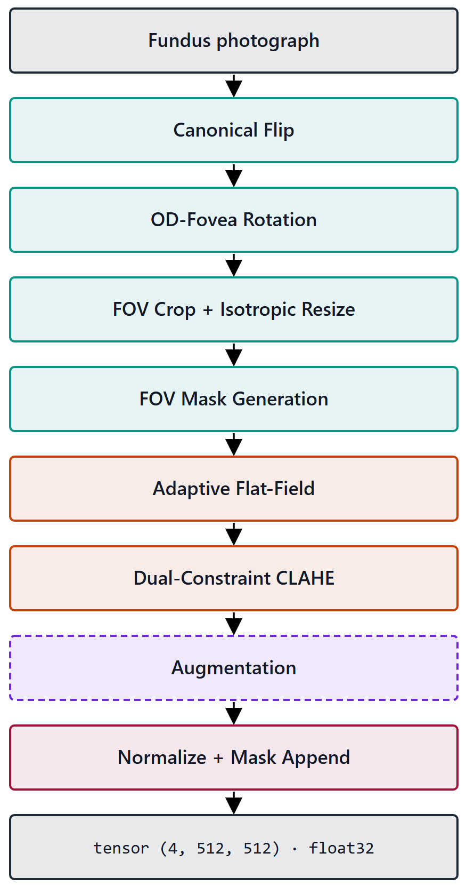
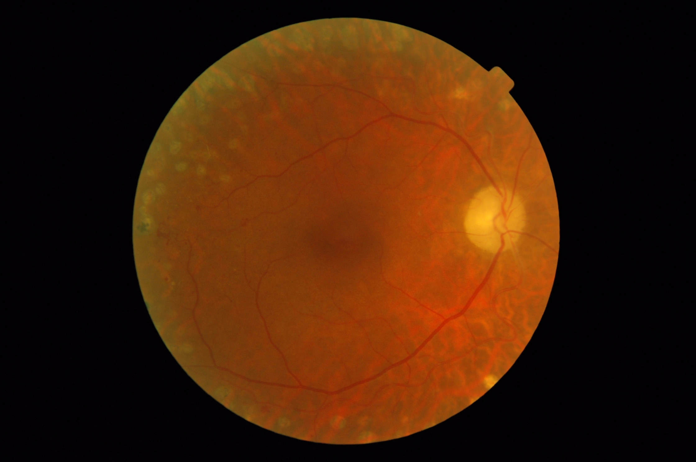
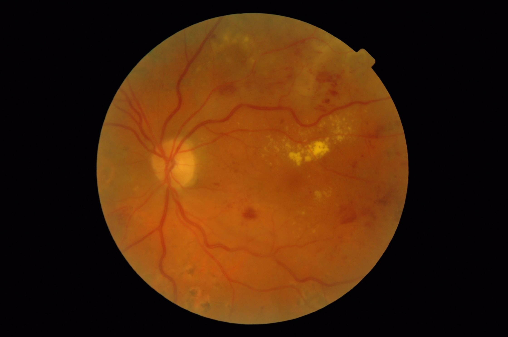

## 1. Тақырып

Препроцессинг кезеңдері: Input

---

## 2. Слайд мазмұны

---

## 3. Баяндаушы сөзі

Слайдта препроцессингінің 8 кезеңі үш функционалдық топқа бөлініп көрсетілген:
- Төрт геометриялық нормализация кезеңі жасыл түспен
- Екі фотометриялық түзету кезеңі қызғылт-сары түспен
- Және аугментация кезеңі күлгін үзік сызықпен қоршалып көрсетілген, себебі тек оқыту фазасында ғана қолданылады
- Қызыл түспен көрсетілген Normalize бен Mask Append

Pipeline-ның шығысы — үш RGB каналы және бинарлы FOV маска.
