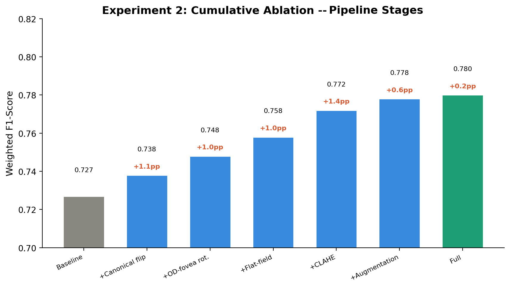
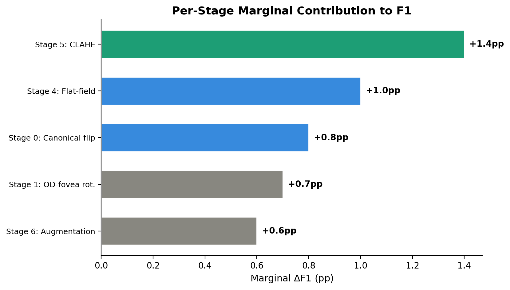
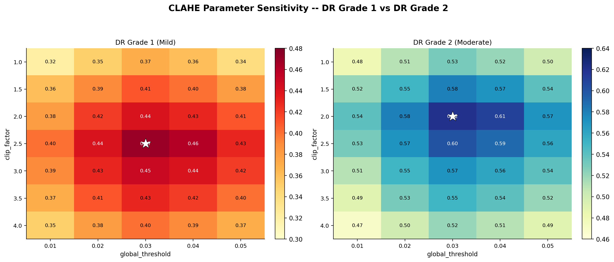

## 1. Тақырып

2-эксперимент: H-2 — V5 компоненттерінің абляциясы

---

## 2. Слайд мазмұны

---

## 3. Баяндаушы сөзі

Сол жақтағы суретте pipeline кезеңдерінің әр модульін кезек-кезек қосу барысында F1 көрсеткішінің өсуі көрсетілген — кумулятивтік абляция. Әр кезеңнің жекелеген маржиналдық үлесі бағаланып, ең үлкен әсерді CLAHE мен flat-field түзеу беретіні анықталды.

Оң жақтағы суретте CLAHE параметрлерінің sensitivity жылулық картасы көрсетілген — модельдің сапасы кең параметр аумағында тұрақты болатынын білдіреді, яғни нақты гиперпараметр мәніне қатты сезімтал емес.

