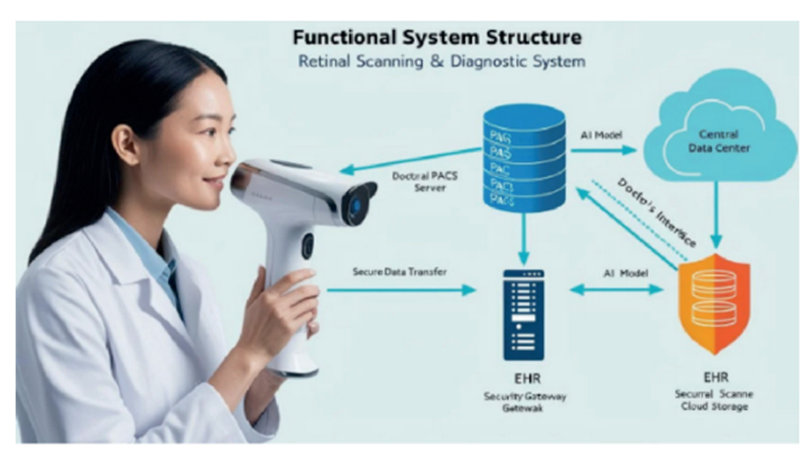

## 1. Тақырып

Практикалық маңыздылығы

---

## 2. Слайд мазмұны

**1. Шектеулі ресурстарда қолданымды шешім**
- RTX 3060 (consumer-grade) жеткілікті; ~19 сурет/с
- Pipeline overhead тек ~27 ms/сурет

**2. Камераға тәуелсіз жалпыланғыштық қабілеті**
- 5 камера өндірушісінде тексерілді (Canon, Topcon, Kowa, Zeiss, жергілікті)
- Қашықтан скрининг пен телемедицинаға бейімделген

**3. Doctor-AI Feedback Loop**
- ALO (Attention–Lesion Overlap) метрикасы арқылы офтальмолог CNN шешімінің клиникалық негізділігін тексере алады
- Grad-CAM heatmap — шешім қабылдау процесінің визуализациясы

**4. Қайта өндірілу**
- seed = 42, deterministic = true, patient-level CV
- Код пен конфигурация қолжетімді

**Болашақ бағыттар:** ViT/ConvNeXt тексеру, end-to-end pipeline оңтайландыру, проспективті клиникалық зерттеу, edge deployment, Қазақстан клиникалық деректер базасы

---

## 3. Баяндаушы сөзі

Практикалық маңыздылығы төрт тұрғыдан. Біріншіден, шешім consumer-grade GPU-да жұмыс істейді — клиникалық ортада қолжетімді. Екіншіден, pipeline камераға тәуелсіз — Canon-мен оқытылған модель Topcon, Kowa, Zeiss камераларында да жұмыс істейді, қашықтан скринингке бейімделген. Үшіншіден, ALO метрикасы мен Grad-CAM heatmap арқылы офтальмолог модельдің шешімін тексере алады — Doctor-AI Feedback Loop. Төртіншіден, нәтижелер қайта өндіріледі. Болашақ бағыттар: заманауи архитектуралар, проспективті клиникалық зерттеу, edge deployment, Қазақстан деректер базасын кеңейту.

---

## 4. Қосымша — Терминдер

- **Telemedicine (телемедицина)** — қашықтан медициналық қызмет көрсету: пациент пен дәрігер арасында физикалық байланыссыз, желілік-ақпараттық технологиялар арқылы диагностика мен консультация жүргізу.
- **Doctor–AI Feedback Loop** — диссертанттың авторлық термині: офтальмолог ALO арқылы CNN шешімінің клиникалық негізділігін тексеретін кері байланыс механизмі.
- **Edge deployment** — модельді клиникалық немесе мобильді құрылғыда (бұлтты сервер емес) жергілікті орындау.
- **Patient-level CV** — кросс-валидация бөлулері пациент деңгейінде жасалуы (бір пациенттің суреттері бір ғана бөлікке түсуі).
