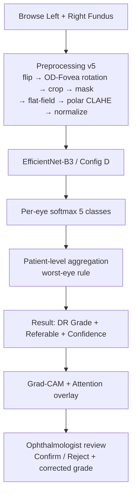

# TASK.md — Описание рисунков Omarov + карта ресурсов для моих аналогов (диабетическая ретинопатия)

> Источник: Tursynova A., **Omarov B.** et al. «Deep Learning-Enabled Brain Stroke Classification on Computed Tomography Images», CMC, 2023, vol.75, no.1, DOI: 10.32604/cmc.2023.034400
>
> Тема Omarov: бинарная классификация инсульта (stroke / normal) по КТ-снимкам мозга + Streamlit + ngrok.
> Моя тема: **5-классная классификация диабетической ретинопатии (ДР 0..4) по фундус-снимкам глаз** + React-демо + Grad-CAM.
>
> Картинки страниц Omarov с рисунками: `webApp/figures_omarov/page_03.png … page_12.png`.

---

# 0. Карта существующих ресурсов в проекте

## 0.1 Исходные датасеты (`E:\datasets\`)

| Датасет     | Путь                                              | Метки                    | Использование                          |
|-------------|---------------------------------------------------|--------------------------|----------------------------------------|
| EyePACS     | `EyePACS\` (+ `trainLabels.csv`)                  | DR 0..4                  | Основной train (exp1, exp2)            |
| Messidor-2  | `Messidor-2\` (+ `messidor-2.csv`)                | DR 0..4 (adjudicated)    | External test (exp5)                   |
| IDRiD       | `IDRiD\B. Disease Grading\` (+ Training/Testing labels CSV) | DR 0..4         | exp5 + clinical-grade benchmark        |
| IDRiD seg   | `IDRiD\A. Segmentation\2. All Segmentation Groundtruths\` | masks MA/HE/EX/SE/OD | **Figure 2 lesion overlays** + Grad-CAM IoU (exp4) |
| IDRiD loc   | `IDRiD\C. Localization\2. Groundtruths\` | OD center, Fovea center  | OD-Fovea rotation (stage 1) reference  |
| APTOS 2019  | `APTOS 2019\` (+ `train.csv`, `test.csv`)         | DR 0..4                  | exp3 transferability                   |
| RFMiD       | `RFMiD\` (Training/Validation/Testing Labels CSV) | multilabel (28 dz)       | exp6 device shift (DR-subset filter)   |
| DDR         | `ddr\DDR_dataset\DDR-dataset\DR_grading\`         | DR 0..4 + ungradable     | exp6 device shift                      |
| ODIR-5K     | `ODIR-5K\` (per config — папка ещё не индексировалась) | 8-disease multilabel | exp6 device shift (DR labels only)     |
| clinical    | `clinical\metadata.csv`                           | внутренний клиниче-ский | exp7 small-data + qualitative Grad-CAM |

## 0.2 Препроцессинг pipeline — уже сгенерированы (5 grades × 2 глаза)

`demo/public/pipeline/dr0{0..4}/{input,preprocessing,results}/`:

| Stage   | Папка                                  | Что внутри                                              |
|---------|----------------------------------------|---------------------------------------------------------|
| Input   | `input/{left,right}.png`               | сырой фундус                                            |
| Stage 0 | `preprocessing/stage_0_canonical_flip/`| горизонт. отражение левого глаза                        |
| Stage 1 | `stage_1_od_fovea_rotation/{od,fovea,midpoint,image}/` | 4 варианта центра поворота |
| Stage 2 | `stage_2_fov_crop_resize/`             | FOV-crop + isotropic resize 512×512                     |
| Stage 3 | `stage_3_fov_mask/`                    | бинарная маска FOV                                      |
| Stage 4 | `stage_4_flatfield/`                   | adaptive flat-field σ=0.07·D                            |
| Stage 5 | `stage_5_clahe/{,cv2,polar}/`          | 3 варианта CLAHE + 5 polar-substeps (vessel detection, density map, polar grid, ...) |
| Stage 6 | `stage_6_augmentation/{1_rotation .. 5_brightness_contrast}/` | min/max + distribution.png |
| Stage 7 | `stage_7_normalize/`                   | dataset-specific normalize                              |
| Results | `results/{gradcam,attention_overlay,prediction}/` | pre-rendered explainability proxies         |

Скрипты-генераторы: `demo/public/pipeline/helpers/s0..s8*.py` + `README.md` (полный workflow).

## 0.3 Готовые графики экспериментов (`demo/public/images/results/`)

| Файл                                            | Что показывает                              | Подходит для                    |
|-------------------------------------------------|---------------------------------------------|---------------------------------|
| `exp1/01_exp1_factorial_f1.png`                 | F1 по 4 конфигам (A/B/C/D)                  | Comparison table                |
| `exp1/02_exp1_all_metrics.png`                  | F1+AUC+κ+Acc по конфигам                    | Comparison table                |
| `exp1/03_exp1_delta.png`                        | Δ-метрики                                   | Comparison table                |
| `exp1/18_per_class_f1.png`                      | F1 по каждому из 5 классов DR               | **доп. к рис. 9**               |
| `exp1/19_training_curves.png`                   | train/val loss + accuracy кривые            | **Figure 8**                    |
| `exp1/20_confusion_matrix.png`                  | 5×5 confusion matrix                        | **Figure 9**                    |
| `exp1/22_exp1_all_6_configs.png`                | расширенное сравнение                       | Comparison                      |
| `exp1/24_roc_curves.png`                        | ROC-кривые (5 классов one-vs-rest)          | **Figure 7 (как ROC-альт.)**    |
| `exp2/04_exp2_ablation.png` … `23_*`            | ablation по стадиям препроцессинга          | Доп. результаты                 |
| `exp4/06_exp4_alo.png`, `07_exp4_iou.png`       | Grad-CAM IoU с IDRiD масками                | Explainability                  |
| `exp4/27_gradcam_overlay.png`                   | Grad-CAM overlay примеры                    | **Figure 10 (доп. контент)**    |
| `exp4/28_attention_consistency.png`             | согласованность атеншена                     | Explainability                  |
| `exp5/08_exp5_generalization.png`, `09_*`       | кросс-датасет F1                             | exp5 results                    |
| `exp6/10_exp6_device_shift.png`                 | сдвиг по устройствам                         | exp6 results                    |
| `general/11_summary_radar.png`                  | radar-чарт всех метрик                       | Сводка                          |
| `general/14_clinical_metrics.png`               | clinical-сабсет метрики                      | exp7                            |
| `general/15_calibration.png`                    | калибровочные кривые                         | Доп. анализ                     |
| `general/16_image_quality.png`                  | quality-метрики                              | exp7                            |
| `general/17_computational.png`                  | latency / FLOPs                              | exp7                            |
| `general/21_statistical_tests.png`              | bootstrap / paired tests                     | exp7                            |
| `general/25_pipeline_stages_real.png`           | визуализация всех stages на реальных снимках | **Figure 4 (доп. иллюстрация)** |
| `general/26_bilateral_pair.png`                 | пара левый+правый глаз                       | **Figure 1/3 (доп.)**           |

## 0.4 Исходный код (`experiments/`)

| Папка/файл                                      | Назначение                                          |
|-------------------------------------------------|-----------------------------------------------------|
| `configs/default.yaml`                          | все гипер-параметры + пути к датасетам              |
| `src/models/{efficientnet,resnet,factory,patient_model}.py` | модели (EfficientNet-B3/B4, ResNet50)   |
| `src/training/{trainer,patient_trainer,losses,checkpoint}.py` | обучение (Focal loss, AdamW, scheduler) |
| `src/preprocessing/pipeline_v5.py` + остальное  | V5 препроцессинг (исп. в stage_0..7)                |
| `src/explainability/{gradcam,iou,visualization}.py` | Grad-CAM + IoU метрика                           |
| `src/evaluation/{metrics,calibration,statistical_tests}.py` | метрики + bootstrap                     |
| `src/data/{datasets,messidor2_dataset,clinical_dataset,splits,label_harmonization,augmentation_v4}.py` | загрузка датасетов |
| `outputs/backup_exp1_full/metrics.csv`          | сырой лог обучения (epoch/fold/config/F1/AUC/κ/Acc) |
| `outputs/backup_exp1_abc_40pct_20260324/metrics.csv` | 40%-subset baseline                              |
| `scripts/verify_exp{1..7}.py`                   | recompute/verify scripts на готовых результатах     |

## 0.5 Web-приложение (`demo/`)

| Файл                                | Назначение                                                 |
|-------------------------------------|------------------------------------------------------------|
| `src/tabs/Demo.js`                  | **главная live-inference страница** (Figure 10)            |
| `src/tabs/ModelArchitecture.js`     | визуализация архитектуры (Figure 5)                        |
| `src/tabs/ModelMethods.js`          | объяснение методов                                         |
| `src/tabs/ModelPipeline.js`         | визуализация препроцессинг-stages (Figure 4 / pipeline)    |
| `src/tabs/ModelExplainability.js`   | Grad-CAM раздел                                            |
| `src/tabs/Datasets.js`              | описание датасетов (Figure 3)                              |
| `src/tabs/Results{Main,Statistical,BestConfig}.js` | сводка результатов                          |
| `src/tabs/Exp{H1..H7}.js`           | по эксперименту-гипотезе                                   |
| `src/tabs/Val{Clinical,Computational,Quality}.js` | валидация                                   |

---

# 1. Per-figure план + ресурсы + чего не хватает

## Рисунок 1 — Sample CT images per class

**Omarov:** сетка 3 × 4 = 12 КТ-снимков, по строкам (a) ischemic, (b) hemorrhagic, (c) normal.

**Мой аналог:** сетка 5 × 4 фундусов, по строкам (a) DR 0, (b) DR 1, (c) DR 2, (d) DR 3, (e) DR 4.

**Доступные ресурсы:**
- `E:\datasets\EyePACS\trainLabels.csv` — позволит выбрать снимки с известной grade.
- `demo/public/datasets/eyepacs/samples/dr{0..4}/*.jpeg` — уже отобранные сэмплы (по 5–10 шт. на класс).
- `demo/public/datasets/idrid/samples/dr{0..4}/*.jpg` — высокого качества (IDRiD).
- `demo/public/datasets/messidor2/samples/dr{0..4}/*` — Messidor-2.
- `demo/public/datasets/ddr/samples/dr{0..4}/*` — DDR.
- Скрипт `experiments/scripts/visualize_od_fovea.py` (как референс компоновки).

**Чего не хватает:** только финального скрипта-композитора (matplotlib `plt.subplots(5, 4)`). Сам composer пишется за 30 строк.

**Команда генерации (примерно):**
```python
# webApp/scripts/fig1_grid_per_class.py
fig, axes = plt.subplots(5, 4, figsize=(10, 12))
for r, g in enumerate(range(5)):
    for c, p in enumerate(sorted(glob(f"demo/public/datasets/eyepacs/samples/dr{g}/*"))[:4]):
        axes[r, c].imshow(Image.open(p)); axes[r, c].axis("off")
    axes[r, 0].set_ylabel(f"({chr(97+r)}) DR {g}", rotation=0, ha='right')
```

---

## Рисунок 2 — Lesions with red overlay (foci marking)

**Omarov:** красные контуры очагов поверх КТ, стрелки справа («Ischemic / Hemorrhagic Images»).

**Мой аналог:** красные overlay типичных признаков ДР на фундусе.

**Доступные ресурсы — практически всё готово:**
- IDRiD сегментация — **готовые pixel-level маски** в `E:\datasets\IDRiD\A. Segmentation\2. All Segmentation Groundtruths\`:
  - `1. Microaneurysms\IDRiD_NN_MA.tif`
  - `2. Haemorrhages\IDRiD_NN_HE.tif`
  - `3. Hard Exudates\IDRiD_NN_EX.tif`
  - `4. Soft Exudates\IDRiD_NN_SE.tif`
  - `5. Optic Disc\IDRiD_NN_OD.tif`
- Соответствующие RGB-снимки: `E:\datasets\IDRiD\A. Segmentation\1. Original Images\{a. Training Set,b. Testing Set}\IDRiD_NN.jpg`
- В `experiments/src/explainability/visualization.py` — функции наложения масок (могут быть переиспользованы).

**Чего не хватает:** скрипта, который для каждой подстроки (a–e) берёт по 4 снимка с непустой соответствующей маской, рисует контур маски красным (`cv2.drawContours` или `np.where(mask)` + `imshow` с красным alpha) и компонует сетку 5 × 4 + стрелочные подписи справа.

```python
# webApp/scripts/fig2_lesion_overlays.py
import cv2, numpy as np, matplotlib.pyplot as plt
LESION_DIRS = {
  "Microaneurysms": "1. Microaneurysms", "Haemorrhages": "2. Haemorrhages",
  "Hard Exudates":  "3. Hard Exudates",  "Soft Exudates": "4. Soft Exudates",
  "Optic Disc":     "5. Optic Disc",
}
# load img + mask, threshold mask, drawContours red, subplot
```

**Не критично, но желательно:** unification — все 4 снимка в строке должны быть одной анатомической ориентации (после canonical flip).

---

## Рисунок 3 — Contents of the dataset

**Omarov:** 2 × 5 = 10 снимков с подписями `normal`/`stroke` над каждым.

**Мой аналог:** 2 × 5 или 3 × 5 фундусов с подписями `No DR / Mild / Moderate / Severe / Proliferative DR`, перемешанных.

**Доступные ресурсы:**
- Те же папки `demo/public/datasets/{eyepacs,idrid,messidor2,ddr}/samples/dr{0..4}/`.
- `general/26_bilateral_pair.png` — пример пары левый+правый глаз, **можно вставить как доп. рисунок** (изобразит бинокулярность — то, чего у Omarov нет).
- `EyePACS\trainLabels.csv` — для подсчёта распределения классов в подписи к рисунку.

**Чего не хватает:** скрипта-композитора и текстовой таблицы под рисунком с распределением (train/val/test × {DR0..4} × датасет). Распределение можно посчитать сразу из CSV-ок.

```python
# Подсчёт распределения по 5 классам:
import pandas as pd
df = pd.read_csv(r"E:\datasets\EyePACS\trainLabels.csv")
df['level'].value_counts().sort_index()
```

---

## Рисунок 4 — Flowchart of the proposed system

**Omarov:** вертикальная схема Web App: browse img → CT thumbnail → CNN classification → Result → Medical specialist diagnosis.

**Мой аналог:** Web App: Upload Left+Right Eye → Preprocessing pipeline (7 stages) → EfficientNet-B3 (Config D) → Patient-level aggregation (worst eye) → Result (DR 0–4 + Referable + Grad-CAM) → Ophthalmologist review.

**Доступные ресурсы:**
- `demo/public/images/results/general/25_pipeline_stages_real.png` — **готовая визуализация всех stages на реальных снимках** (можно вставить как inline под flowchart).
- `demo/src/tabs/ModelPipeline.js` — содержит логику отображения stages (можно сделать скриншот вкладки).
- `demo/src/tabs/Demo.js` — UI верхне-уровневого флоу.

**Чего не хватает:**
- **самой блок-схемы как векторного файла** (SVG/PNG). Нужно нарисовать вручную в:
  - draw.io / diagrams.net (рекомендую — векторный, экспорт SVG/PNG);
  - либо в Excalidraw (визуально приятнее);
  - либо Mermaid `flowchart TD` (если устроит стандартный стиль).

**Mermaid-заготовка (можно вставить в TASK.md и отрендерить):**


---

## Рисунок 5 — Architecture of the proposed CNN (artistic)

**Omarov:** горизонтальная «перспективная» визуализация: Input → 5×(Conv/ReLU/MaxPool) → Flatten → 3×Dense → Output. Цветные параллелепипеды.

**Мой аналог:** EfficientNet-B3 в перспективе: Input 512×512×4 → Stem → MBConv1 → … → MBConv7 → 1×1 Conv (1536) → GAP → FC(5) → Softmax.

**Доступные ресурсы:**
- `experiments/src/models/efficientnet.py` — конкретная архитектура, по которой можно вытащить размеры (timm).
- `experiments/src/models/factory.py` — фабрика моделей.
- `demo/src/tabs/ModelArchitecture.js` — уже отображает архитектуру в браузере (можно скриншотить).

**Чего не хватает:**
- **самой artistic-диаграммы**. Варианты:
  - **NN-SVG** (https://alexlenail.me/NN-SVG/AlexNet.html) — генерирует похожий стиль, нужно вручную ввести список слоёв EfficientNet-B3 или сгруппированный.
  - **PlotNeuralNet** (LaTeX/TikZ) — самый красивый, но сложнее.
  - **draw.io / Figma** — вручную.

> EfficientNet-B3 — это ~30 слоёв MBConv. Один-в-один как в Omarov не получится — лучше сделать **сгруппированную** версию (Stem | Block 1 | Block 2 | … | Block 7 | Head) и отдельно показать раскрытие одного MBConv-блока в боковом мини-рисунке.

---

## Рисунок 6 — Proposed CNN (Keras-style detailed)

**Omarov:** Keras `plot_model(show_shapes=True)` — каждый слой как блок «имя | input | output», стрелки.

**Мой аналог:** аналогичный детальный граф моей модели (EfficientNet-B3 head + 4-channel input adapter).

**Доступные ресурсы:**
- `experiments/src/models/efficientnet.py` (PyTorch + timm).
- В PyTorch вместо `plot_model` используются:
  - `torchinfo.summary(model, input_size=(1, 4, 512, 512))` — текстовая таблица слоёв.
  - `torchviz.make_dot(model(x), params=dict(model.named_parameters()))` — граф через graphviz.
  - `Netron` (https://netron.app) — открывает ONNX/PyTorch и рисует красивый граф.

**Чего не хватает:**
- **PNG-картинки графа модели**. Самый быстрый путь — экспортировать модель в ONNX и открыть в Netron, либо собрать `torchviz.make_dot(...)` и `format='png'`.

```python
# webApp/scripts/fig6_model_graph.py
import torch
from torchviz import make_dot
from experiments.src.models.factory import create_model
m = create_model('efficientnet_b3', in_channels=4, num_classes=5).eval()
x = torch.zeros(1, 4, 512, 512)
make_dot(m(x), params=dict(m.named_parameters())).render('webApp/figures_mine/fig6_model_graph', format='png')
```

Альтернатива (рекомендую): `torch.onnx.export(m, x, 'fig6.onnx')` → открыть в [Netron](https://netron.app) → File → Save As PNG.

---

## Рисунок 7 — Precision and recall (PR-curve)

**Omarov:** одна ступенчатая PR-кривая (AP = 0.36 при 10 эпохах).

**Мой аналог:** **5 PR-кривых** (one-vs-rest для DR 0..4) + macro-average AP. Опционально: PR на ранней эпохе vs финальной для контраста.

**Доступные ресурсы:**
- `experiments/outputs/backup_exp1_full/metrics.csv` — **только агрегаты per-epoch** (loss/F1/AUC/κ/Acc), без per-sample вероятностей.
- `demo/public/images/results/exp1/24_roc_curves.png` — есть ROC-кривые (NOT PR). По ROC файлу можно понять, что **предсказания где-то были сохранены** для построения этого графика.
- `experiments/src/evaluation/metrics.py` — есть код метрик.
- `experiments/scripts/verify_exp1.py` — может содержать загрузку предсказаний.

**Чего не хватает:**
- **сырых per-sample вероятностей (softmax outputs)** на тест-сете — нужно либо найти их в outputs (поискать `*.npy`, `*.pkl`, `predictions*`), либо перезапустить inference на сохранённом чекпоинте.
- Если предсказаний нет → нужен:
  1. чекпоинт модели Config D (`*.pth` / `*.ckpt`) — **проверить** `experiments/outputs/` и `models/`;
  2. скрипт inference на test-loader, сохраняющий `y_true, y_prob` → npz;
  3. построение PR через `sklearn.metrics.precision_recall_curve` + `average_precision_score(average='macro')`.

**Скрипт построения (как только y_prob есть):**
```python
from sklearn.metrics import precision_recall_curve, average_precision_score
import matplotlib.pyplot as plt
data = np.load('webApp/data/predictions.npz')  # y_true, y_prob (N, 5)
y_true, y_prob = data['y_true'], data['y_prob']
fig, ax = plt.subplots(figsize=(6, 5))
for c in range(5):
    p, r, _ = precision_recall_curve((y_true == c).astype(int), y_prob[:, c])
    ap = average_precision_score((y_true == c).astype(int), y_prob[:, c])
    ax.step(r, p, label=f'DR {c} (AP={ap:.2f})')
ax.set_xlabel('Recall'); ax.set_ylabel('Precision'); ax.legend()
```

---

## Рисунок 8 — Training/validation loss curves

**Omarov:** 5 кривых на одних осях: `loss`, `accuracy`, `val_loss`, `val_accuracy`, `lr`.

**Мой аналог:** аналогичный график (можно с κ вместо accuracy).

**Доступные ресурсы — всё готово:**
- `demo/public/images/results/exp1/19_training_curves.png` — **уже сгенерированный график**, можно использовать «как есть».
- `experiments/outputs/backup_exp1_full/metrics.csv` — сырые данные для пересборки, если нужен другой стиль.
- Колонки: `epoch,fold,config,train_loss,val_loss,weighted_f1,roc_auc,kappa,accuracy`.

**Чего не хватает:**
- Если хочется **в стиле Omarov на одном полотне** (loss + accuracy + lr) — нужно добавить колонку `lr` (её сейчас нет в metrics.csv). Можно:
  - либо найти лог обучения и достать lr из scheduler;
  - либо реконструировать lr из конфига (ReduceLROnPlateau, factor=0.5, patience=3) — но это будет аппроксимация.
- Желательно сделать **2 субплота** (loss + κ) — более читаемо чем у Omarov.

---

## Рисунок 9 — Confusion matrix

**Omarov:** 2×2 heatmap с числами в ячейках + colorbar.

**Мой аналог:** **5×5** confusion matrix DR 0..4, + (опц.) нормализованная по строкам версия.

**Доступные ресурсы — всё готово:**
- `demo/public/images/results/exp1/20_confusion_matrix.png` — **уже сгенерированный**, можно использовать.
- `demo/public/images/results/exp1/18_per_class_f1.png` — доп. полезный график per-class F1.

**Чего не хватает:**
- Если matrix построена для одного конфига — стоит добавить вариант для Config D (best). Если уже Config D — всё ок.
- Желательно показать **рядом** matrix на EyePACS-test и на Messidor-2 (external) — это сильное доказательство generalization, чего у Omarov нет.

---

## Рисунок 10 — Web-based application screenshot

**Omarov:** скриншот Streamlit-страницы с одним КТ + заключением «79.38% normal».

**Мой аналог:** серия скриншотов React-демо `demo/src/tabs/Demo.js`.

**Доступные ресурсы:**
- **Полнофункциональное React-приложение** `demo/` — нужно `cd demo && npm install && npm start` и сделать скриншоты.
- `demo/src/tabs/Demo.js` — основной компонент (см. строки 444–767 — UI секции Upload / Run / Result / Feedback / History).
- `demo/public/images/results/exp4/27_gradcam_overlay.png` — пример Grad-CAM (для демонстрации Explainability в подписи).
- `demo/public/pipeline/dr0{0..4}/results/{gradcam,attention_overlay}/{left,right}.png` — pre-rendered explainability для walkthrough cases.

**Чего не хватает:**
- **самих скриншотов** — нужно запустить демо локально и сделать 3–5 скриншотов:
  1. Пустая форма (Upload section + Random button + Walkthrough chips DR 0..4).
  2. Загруженная пара глаз (можно DR 2 walkthrough).
  3. Результат с probability bars + per-eye breakdown.
  4. Grad-CAM + attention overlay секция (включается для walkthrough cases).
  5. Feedback panel + History table.

**Команды для скриншотов:**
```bash
cd E:\dissertation-project\demo
npm install  # один раз
npm start    # запустит на http://localhost:3000
# В браузере: Demo tab → Walkthrough chip "DR 2 · GradCAM" → Run inference
# Скриншоты через Win+Shift+S или браузерное расширение
```

---

# 2. Сводная таблица: чего не хватает по каждому рисунку

| #  | Рисунок                | Готово в проекте                                        | Не хватает                                                  | Сложность |
|----|------------------------|---------------------------------------------------------|-------------------------------------------------------------|-----------|
| 1  | Sample images per class| `demo/public/datasets/*/samples/dr{0..4}/`              | скрипт-композитор 5×4 (~30 строк)                           | 🟢 легко |
| 2  | Lesion overlays        | IDRiD A.Segmentation masks (MA/HE/EX/SE/OD) + RGB       | скрипт overlay масок → сетка 5×4 + стрелки                  | 🟢 легко |
| 3  | Dataset contents       | те же samples + CSV-метки                               | скрипт-композитор + текст распределения классов             | 🟢 легко |
| 4  | System flowchart       | компоненты UI готовы, `25_pipeline_stages_real.png`     | **сам блок-схематический рисунок** (Mermaid/draw.io/Excalidraw) | 🟡 средне |
| 5  | CNN architecture (art) | код модели, `ModelArchitecture.js`                      | **artistic-диаграмма** (NN-SVG / PlotNeuralNet / draw.io)   | 🟡 средне |
| 6  | CNN architecture (graph) | код модели + PyTorch                                  | **PNG-граф модели** (torchviz / ONNX → Netron)              | 🟡 средне |
| 7  | PR-curve               | `24_roc_curves.png` (ROC, не PR), metrics.csv (агрегат) | **сырые y_true + y_prob** на тесте → скрипт PR              | 🔴 нужно найти/перезапустить inference |
| 8  | Training curves        | `19_training_curves.png` + `metrics.csv`                | (опц.) колонка lr; готовый PNG можно вставлять «как есть»    | 🟢 готово |
| 9  | Confusion matrix       | `20_confusion_matrix.png` + `18_per_class_f1.png`       | (опц.) вариант для Messidor-2 / Config D рядом              | 🟢 готово |
| 10 | Web-app screenshot     | полностью рабочее `demo/` React-приложение              | **скриншоты** живого UI (нужно запустить локально)          | 🟢 легко |

🟢 = есть всё, делается за час
🟡 = ресурсы есть, но требует внешнего инструмента (draw.io/Netron/NN-SVG)
🔴 = требует найти артефакты (predictions) или перезапустить inference на чекпоинте

---

# 3. Что критически не хватает (high-level)

1. **`predictions.npz` (или эквивалент) для построения PR-кривой (рис. 7).** Нужно проверить:
   - `E:\dissertation-project\experiments\outputs\` — есть только `metrics.csv` (агрегат). Per-sample предсказаний здесь не видно.
   - Возможные местонахождения: `experiments/outputs/exp1/*/predictions*`, `experiments/outputs/exp1/*.npz`. **Сделать рекурсивный поиск.**
   - Если нет → нужен **чекпоинт модели** (`*.pth`) и перезапуск inference (~10 минут на EyePACS test split).

2. **Чекпоинт обученной модели (Config D).** Где-то должен быть `.pth/.ckpt` после обучения; нужно его найти или переобучить. **Без него:**
   - нельзя пересчитать рис. 7 (PR);
   - нельзя сделать «честный» Grad-CAM для рис. 10 (сейчас в Demo.js используется **симулированный** Grad-CAM по flat-field anomaly, не real model output — это указано в комментариях в `Demo.js` строки 14–19).

3. **Векторный graphic-эдитор для рис. 4 и рис. 5** — это просто инструмент (draw.io/Excalidraw/NN-SVG), не код. Не блокер, но требует ручной работы.

4. **Скриншоты UI для рис. 10** — нужно поднять `npm start` локально. Не блокер, занимает 15 минут.

---

# 4. Ключевые отличия моей работы и работы Omarov

(сохраняется из предыдущей версии — для использования в подписях рисунков):

1. **Задача:** Omarov бинарная, у меня 5-классная (DR 0..4 по ICDR).
2. **Модель:** Omarov ~214k параметров CNN, у меня **EfficientNet-B3** (~12M, pretrained ImageNet).
3. **Бинокулярность:** у меня обработка обоих глаз с worst-eye aggregation; у Omarov один снимок.
4. **Explainability:** Grad-CAM + attention IoU vs IDRiD masks (exp4) — у Omarov нет.
5. **Feedback loop:** Confirm/Reject + JSONL export для дообучения — у Omarov нет.
6. **Multi-dataset validation:** EyePACS train + Messidor-2 / IDRiD / DDR / RFMiD / clinical external test; у Omarov 1 датасет Kaggle.
7. **Метрики:** + **Quadratic Weighted Kappa** (стандарт ICDR-grading) + bootstrap CI + statistical tests; у Omarov только Acc/Prec/Rec/F1 поинтово.
8. **Препроцессинг V5:** canonical flip + OD-Fovea rotation + isotropic resize + FOV mask + adaptive flat-field + **Polar CLAHE (novel)** — серьёзная инженерная новизна по сравнению с Omarov (только image flip + resize).
9. **Frontend:** Streamlit+ngrok (Omarov) vs **React SPA с мультиязычностью**, статический деплой, без server-side dependencies.

---

# 5. Папка ресурсов и output-структура

Рекомендую складывать новые сгенерированные рисунки в:

```
E:\dissertation-project\demo\public\webApp\
├── TASK.md                       ← этот файл
├── figures_omarov\               ← сканы PDF Omarov (для сверки)
│   └── page_03.png ... page_12.png
├── figures_mine\                 ← сюда мои аналоги
│   ├── fig1_per_class.png
│   ├── fig2_lesion_overlays.png
│   ├── fig3_dataset_contents.png
│   ├── fig4_flowchart.png
│   ├── fig5_architecture_artistic.png
│   ├── fig6_model_graph.png
│   ├── fig7_pr_curves.png
│   ├── fig8_training_curves.png       (можно копировать из exp1/19_*)
│   ├── fig9_confusion_matrix.png      (можно копировать из exp1/20_*)
│   └── fig10_webapp_screenshot_{1..5}.png
└── scripts\                       ← скрипты генерации
    ├── fig1_grid_per_class.py
    ├── fig2_lesion_overlays.py
    ├── fig3_dataset_contents.py
    ├── fig6_model_graph.py
    └── fig7_pr_curves.py
```
